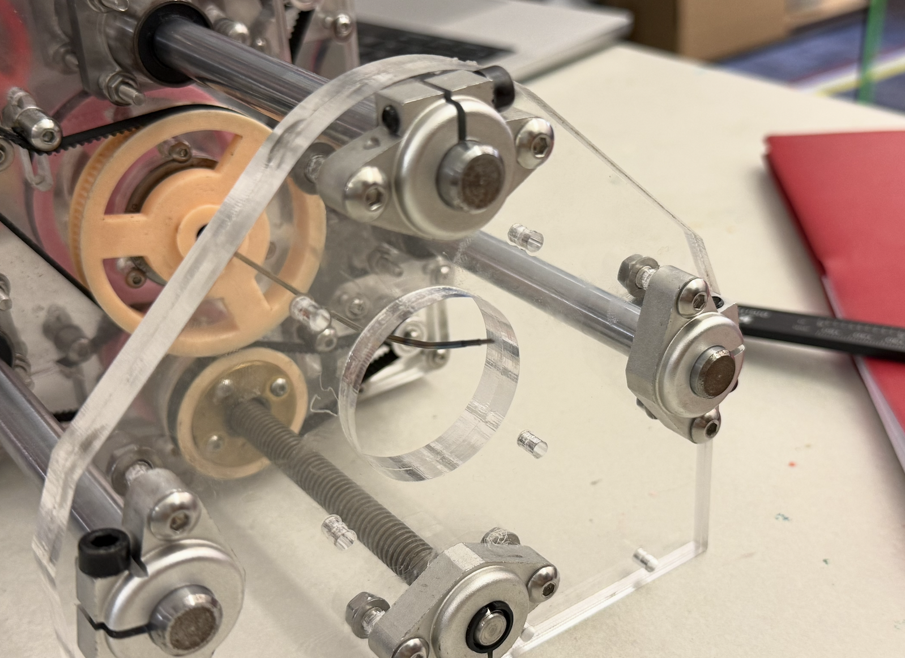
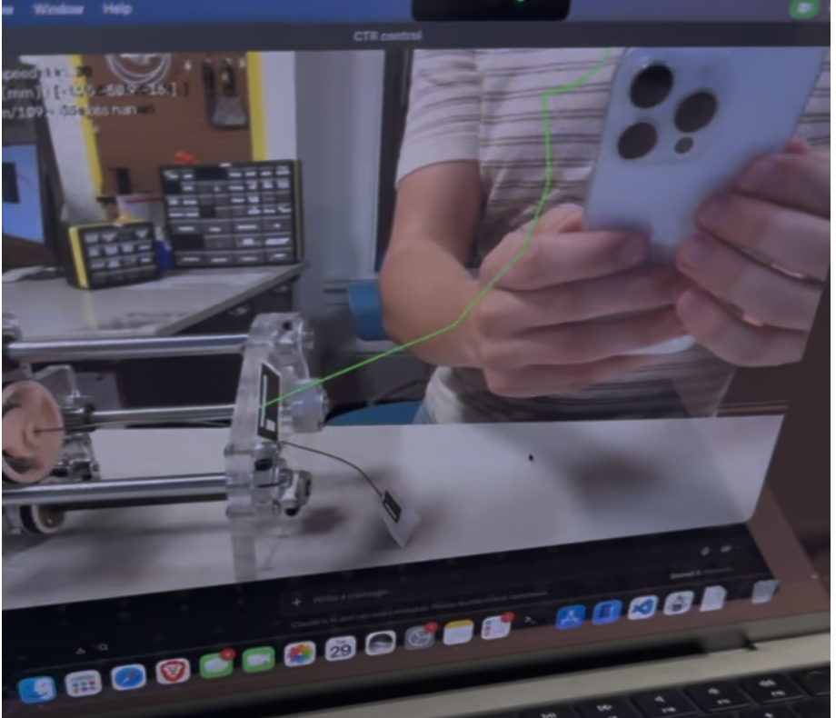

## Progression Notes Doc
## Physics-only model (ctr-sim)
A physics only Cartesian control model using the ctr-sim framework ([original git repo](https://github.com/JackyP1937/ctr-sim))

Code can be found under `ctr-sim`, and the main entrance script is `ctr_teleop.py`. It is necessary to install the python packages in `requirements.txt` and to also build and install the ctr-sim framework in that same directory. More info to install ctr-sim is in the `README.MD` in the subsequent directory.

Movement is controlled through either keyboard input or through a game controller input, and current tube configurations, along with initial rotation and movement of tubes, are stored inside the main script and are up to date. 

Currently (**10/06/26**), due to an implementation error or configuration error, the script does not accurately predict where it goes.
## 
#### ctr-sim notes:
* Whenever changing the tubes or setting up new ones, it is nessary to find the precurvature of the tubes. If they are unknown a script found at `ctr-sim/precurvature/measure_precurvature.py` is used to take a straight down picture of the tube, and find the precurvature of the model. You must select the points of the bend to find it accurately, and an aruco tag of 60mm must be placed near the tube for reference.
* When starting the script it is sometimes necessary to set the rotation of at least one of the tubes to `θ>0` so that the kinematics do not fail.

## 
**Initial setup of the tubes** (reference to first starting the `ctr_teleop.py` script; i.e. 0 degrees rotation)

**ctr-sim teleop GUI**

## Physics Informed Model
###### (Last update Oct. 1; Not currently in progress)
An attempt to create a physics informed neural network was created. Aruco tags on the base of the robot and on the tip were used to train the robot, both before running it live, and during. A GUI showed the "predicted" path based on where you indicated to move the tip.

Although a PIF neural network in the long term could lead to more precise results, the current implementation did not properly work and movement was unpredictable. This may be due to unrefined parameters, illogical code, an incorrect physics model, or any combination of the three.

Code can be found in the `pif-controller` directory, with the entrance script being `main.py`. More info about aruco marker code is below.

## Aruco Markers 
###### (Last update Sept. 28; Not currently in progress)
Aruco markers need calibration to work properly, and a script to calibrate it is in the `aruco-markers` directory under `aruco-marker-test.py`.

This code was produced to assist the PIF model, and so to use the camera calibration made by the test script a `fix-calibration.py` script is needed to convert the format into one that works with the PIF model.

## Additional Notes
- **(10/06/26)** All of the code generated expects that 1 unit sent over serial equates to 1mm of lead axis movement, however it does not even come close to the standard config with the current Marlin build that is on the Octopus Controller. Therefore, it is necessary to send `M92 X6760 Y6760 Z6760` over serial whenever the robot powers up to set the movement to ~1mm for 1 unit of movement.